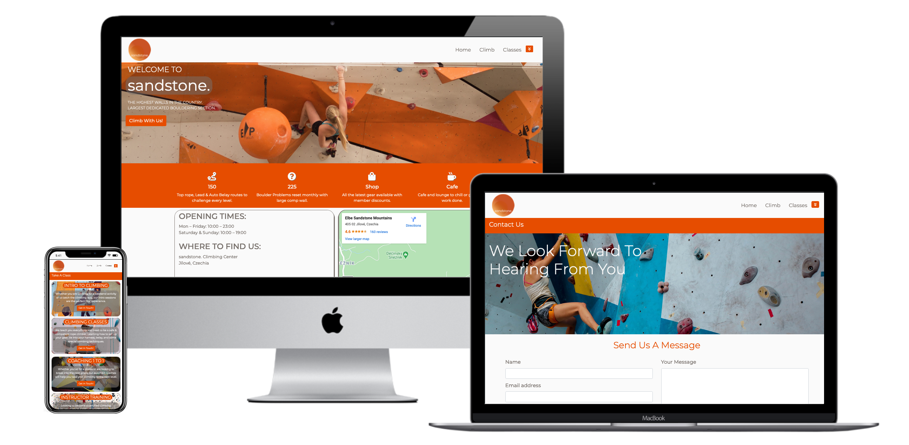

<h1 align="center">MS1</h1>

This is a website for Sandstone the climbing gym. Designed to be eye-catching, responsive & accessible on different devices.

## User Experience

### User Stories

- First Time Visitor
    - When I visit this site I want to easily understand the purpose of the site and learn about the gym and it's specifications.
    - I would also like to be able to navigate through the site with ease and find the content I need such as the location of the gym.
    - I may want to contact the gym to ask questions about courses/classes or the gym in general.
- Returning Visitor
    - As a returning visitor I might be looking to sign up to the newsletter or find social links so I can keep up with events.
    - I may also be considering membership, so finding that page smoothly and seeing the membership sign up button easily would be ideal.
- Frequent User
    - As a frequent user I use the site to book courses especially the 1 to 1 session.

### Design

- Color Scheme
    - Used a color called 'Sandstone" #786D5F since that was the theme. I also used an orange to accompany it and match some of the photos I managed to include. I finally used a white as I had used it in my logo.

- Typography
    - The Montserrat font is the main font used with Roboto as a secondary font. If the font isn't being imported into the site correctly the fallback is sans-serif.
- Imagery
    - I think having images of people using the gym is a useful way to show the equipment available but also to make the website more appealing.

- Wireframes
    - I created Wireframes for various extra pages such as membership forms and an about us page. However, these extra pages and are not core to the design of the website so are not included.
        - [Home Page](/workspace/Code-Institute-MS1/documentation/ms1-wireframe/index.html.png)
            1. I moved the section describing what equipment the gym had above the map as I believe it is initially more important.
        - [Climb Page](/workspace/Code-Institute-MS1/documentation/ms1-wireframe/membership.html.png)
            1. I made a few changes to this page. I included the equipment rental costs in the non-membership section to help reinforce the benefits of membership.
            1. I also decided to use a vertical image to try a different style especially since it was a really good picture to show off the height of the climbing walls.
        - [Classes Page](/workspace/Code-Institute-MS1/documentation/ms1-wireframe/classes.html.png)
            1. I also made changes to this page. The text that becomes visible on mouse hover did a good job of describing the classes so I felt like I didn't need the banner.
            1. Also, since I was using an image for each class box I felt like I would overload the viewer with images if I also had a giant banner image.
        - [Contact Page](/workspace/Code-Institute-MS1/documentation/ms1-wireframe/contact_us.html.png)
            1. Made no substantial changes to this design.

## Features

- The website should be responsive across different devices.
- Have some interactive elements such as the buttons, dropdown menu, and google map.

### Taking The Project Further

If I were taking the project further there are some features I believe would benefit the website and add more functionality to it:
- Adding a check-out screen for when customers sign-up for a membership.
- Having a system where a customer can view time slots on a calendar when booking onto classes.
- The website would also benefit from a scrolling news section on the homepage.

## Technologies

### Languages

- [HTML5](https://en.wikipedia.org/wiki/HTML5)
- [CSS3](https://en.wikipedia.org/wiki/CSS)

### Frameworks, Libraries & Programs Used

1. [Bootstrap4.5.2](https://getbootstrap.com/): Responsiveness & style.

1. [Hover.css](http://ianlunn.github.io/Hover/): Skew & Grow by Ian Lunn used in header.

1. [Gitpod](https://www.gitpod.io/): Code is written with Gitpod and used for version control via the terminal to commit to Git and push to GitHub.

1. [Github](https://github.com/): GitHub is used to store the project after being pushed from Git.

1. [Google Fonts](https://fonts.google.com/?query=Oswa): Were used to import the 'Montserrat' & 'Roboto' font.

1. [Google Map](https://www.google.co.uk/maps): Embeded.

1. [Font Awesome](https://fontawesome.com/): Font Awesome was used on various pages to add icons.

1. [Balsamiq](https://balsamiq.com/): Balsamiq was used to create the wireframes during the design process.

## Testing

The W3C Markup Validator and W3C CSS Validator Services were used to validate all pages of this project. This ensures there were no syntax errors in the project.

-   [W3C Markup Validator](https://validator.w3.org/) - [Results](https://github.com/S-Lowes/Code-Institute-MS1/blob/master/documentation/images/html-valid.png)
-   [W3C CSS Validator](https://jigsaw.w3.org/css-validator/) - [Results](https://github.com/S-Lowes/Code-Institute-MS1/blob/master/documentation/images/css-valid.png)

### Testing User Stories

- First Time Visitor
    - When I visit this site I want to easily understand the purpose of the site and learn about the gym and it's specifications.
        1. Upon entering the site the user will see the banner image which should convey what the site is about.
        1. Scrolling down a little they will see a list of the services the gym provides such as the # of climbing routes.
        1. The user then has a few buttons prompting a call to action, one urging them to come and climb and the other asking if they would like to get in touch.
    - I would also like to be able to navigate through the site with ease and find the content I need such as the location of the gym.
        1. The gym's location is easily found on the home page thanks to google maps.
    - I may want to contact the gym to ask questions about courses/classes or the gym in general.
        1. The 'Contact Us' button that leads to the contact.html page is alongside the map.
- Returning Visitor
    - As a returning visitor I might be looking to sign up to the newsletter or find social links so I can keep up with events.
        1. Signing up to the newsletter is done at the footer where social links can be found.
        1. Social links can also be found in the header via the dropdown button.
    - I may also be considering membership, so finding that page smoothly and seeing the membership sign up button easily would be ideal.
        1. The membership page can be found from the 'Climb with us' button and also from the header 'Climb".
- Frequent User
    - As a frequent user I use the site to book courses especially the 1 to 1 session.
        1. This can be accessed from the 'Classes" classes.html page.

### Further Testing

- So far testing has been on safari, firefox, and chrome.
- The website was viewed on a variety of devices such as a Laptop, iPhone, and Ipad.
- Friends and family members were asked to review the site and documentation to point out any bugs and/or user experience issues.

### Known Bugs

- On mobile, our buttons used to navigate the website have a white transparent overlay.

### Mentor Feedback

- Footer had an extended margin which was causing a horizontal scroll bar.
- Location information box on index.html was possibly an off-putting color. This was changed to white with a sandstone colored border.
- Organise folders and add documentation folder, remove any media not being used.
- Add the social media icons used in the header to the footer.
- Create a contact page to link to any membership or class buttons so they are not dead links.
- README: User stories from the visitor perspective + Testing section.
- Deploy on Github.
- Shadow on Map for different media screens needs to flip to the other side.

## Deployment

### Github Pages

The project was deployed to GitHub Pages using the following steps:

- Log in to GitHub and locate the GitHub Repository.
- At the top of the Repository find the "Settings" button on the menu.
- Scroll down the Settings page until you locate the "GitHub Pages" Section.
- Under "Source", click the dropdown called "None" and select "Master Branch".
- For the folder selection we selected "Root".
- The page will automatically refresh.
- Scroll back down through the page to locate the now published site link in the "GitHub Pages" section.

## Credits

### Code & Media

The space to share any resources I have used to help me build this project.

1. [Bootstrap4.5.2](https://getbootstrap.com/): Bootstrap Library used throughout the project.

1. [Logo created on ucraft](https://www.ucraft.com/free-logo-maker): Also used in header.

1. [Multi Media Mockup](https://techsini.com/multi-mockup/): For the README.

1. [Unsplash](https://unsplash.com/) & [Pexels](https://www.pexels.com/): Used both these websites to find free images, Unsplash was most useful.

### Acknowledgements

- My Mentor for the helpful feedback.
- Tutor support at Code Institute for their support.