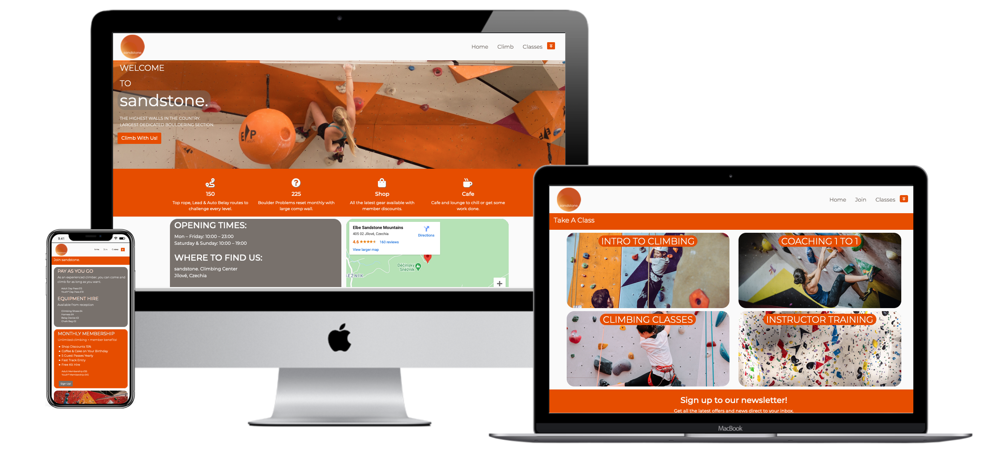

Welcome S-Lowes,

# MS1 Code Institute

I have decided to make a mock website for an imaginary climbing gym. Designed to be eye catching, responsive & accesible on different devices.

# User Experience

## User Stories

- First Time Visitor
    - When I visit this site I want to easily understand the purpose of the site and learn about the gym and it's specifications.
    - I would also like to be able to navigate through the site with ease and find the content I need such as the gyms location.
    - I may want to contact the gym to ask questions about courses/classes or about the gym in general.
- Returning Visitor
    - As a returning visitor I might be looking to sign up to the newsletter or find social links so I can keep up with events.
    - I may also be considering membership, so finding that page smoothly and seeing the membership sign up button easily would be ideal.
- Frequent User
    - As a frequent user I use the site to book courses especially 1 to 1 sessions.

## Design

- Color Scheme
    - Used a color called 'Sandstone" #786D5F since that was the theme. I also used an orange to accompany it and match some of the photos I managed to include. I finally used a white as I had used it in my logo.

- Typography
    - The Montserrat font is the main font used with Roboto as a secondary font. The fallback font in case for any reason the font isn't being imported into the site correctly is sans-serif.

- Imagery
    - I think having images of people using the gym is a useful way to show the equipment available but also to make the website more appealing.

- Wireframes
    - I created Wireframes for various extra pages such as membership forms and an about us page. However these extra pages and are not core to the websites design so are not included.
        - [Home Page](/workspace/Code-Institute-MS1/documentation/ms1-wireframe/index.html.png)
        - [Climb Page](/workspace/Code-Institute-MS1/documentation/ms1-wireframe/membership.html.png)
        - [Classes Page](/workspace/Code-Institute-MS1/documentation/ms1-wireframe/classes.html.png)
        - [Contact Page](/workspace/Code-Institute-MS1/documentation/ms1-wireframe/contact_us.html.png)

# Languages

- [HTML5](https://en.wikipedia.org/wiki/HTML5)
- [CSS3](https://en.wikipedia.org/wiki/CSS)

# Testing

- First Time Visitor
    - When I visit this site I want to easily understand the purpose of the site and learn about the gym and it's specifications.
        1. Upon entering the site the user will see the banner image which should convey what the site is about.
        1. Scrolling down a little they will see a list of the services the gym provides such as the # of climbing routes.
        1. The user then has a few call to action buttons, one urging them to come and climb and the other asking if they would like to get in touch.
    - I would also like to be able to navigate through the site with ease and find the content I need such as the gyms location.
        1. The gym's location is easily found on the home page thanks to google maps.
    - I may want to contact the gym to ask questions about courses/classes or about the gym in general.
        1. The 'Contact Us' button that leads to the contact.html page is alongside the map.
- Returning Visitor
    - As a returning visitor I might be looking to sign up to the newsletter or find social links so I can keep up with events.
        1. Signing up to the newsletter is done at the footer where social links can be found.
        1. Social links can also be found in the header via the dropdown button.
    - I may also be considering membership, so finding that page smoothly and seeing the membership sign up button easily would be ideal.
        1. The membership page can be found from the 'Climb with us' button and also from the header 'Climb".
- Frequent User
    - As a frequent user I use the site to book courses especially 1 to 1 sessions.
        1. This can be accessed from the 'Classes" classes.html page.

## Further Testing

- So far testing has been on safari & firefox but chrome will be used shortly.
- The website was viewed on a variety of devices such as Laptop, Iphone, Ipad.
- Friends and family members were asked to review the site and documentation to point out any bugs and/or user experience issues.
 

## Taking The Project Further

# Credits

## Technologies & Code Credit

The space to share any rescources I have used to help me build this project.

- [Gitpod](https://www.gitpod.io/): Code written with Gitpod and used for version control via the terminal to commit to Git and Push to GitHub.

- [Github](https://github.com/): GitHub is used to store the project after being pushed from Git.

- [Google Fonts](https://fonts.google.com/?query=Oswa): Google fonts was used to import the 'Montserrat' & 'Roboto' font.

- [Font Awesome](https://fontawesome.com/): Font Awesome was used on various pages to add icons.

- [Bootstrap4.5.2](https://getbootstrap.com/): Bootstrap Library used throughout the project.

- [Google Map](https://www.google.co.uk/maps): Embeded.

- [Logo created on ucraft](https://www.ucraft.com/free-logo-maker): Also used in header.

- [Hover.css](http://ianlunn.github.io/Hover/): Skew & Grow by Ian Lunn used in header.

- [Multi Media Mockup](https://techsini.com/multi-mockup/): For the README.

- [Balsamiq](https://balsamiq.com/): Balsamiq was used to create the wireframes during the design process.

- [Unsplash](https://unsplash.com/) & [Pexels](https://www.pexels.com/): Used both these websites to find free images, Unsplash was most useful.

# Acknowledgements

- My Mentor for the helpful feedback.
- Tutor support at Code Institute for their support.